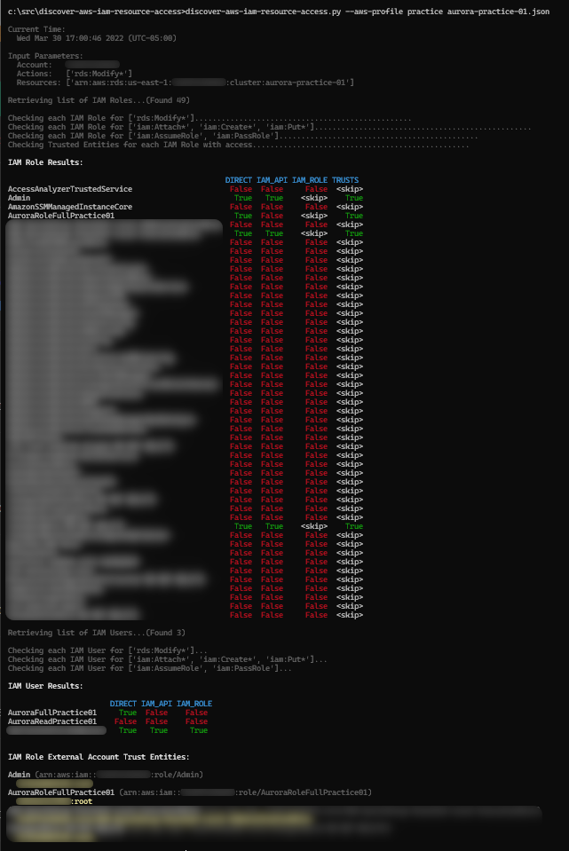

# Purpose

A Python script to discover AWS IAM identities (users and roles) with specified access to specified resources.

Specify a list of actions and a list of resources in a parameter file, then run the script against an AWS account.
Output shows the IAM users and roles that have any of the specified access to any of the specified resources, directly
or indirectly. Also, shows which of the users and roles with access allow external trust entities (i.e., can be used
from other accounts).

# Installation

No installation is required.  Simply execute the discover-aws-iam-resource-access.py Python script.

### Dependencies

* Python 3.9+
    * Developed using Python 3.10.
* Third-Party Python Libraries
    * Missing libraries will be identified at time of execution.
    * Or, see the [requirements.txt](requirements.txt) file.
    * Or, see the "Imports" section at the top of the discovery-aws-iam-resource-access.py file.

# Usage

A parameter file specifying the access and resources of interest is required:

**_example-rds.json_**

```
{
  "ACTIONS": [
    "rds:Add*",
    "rds:Apply*",
    "rds:Authorize*",
    "rds:Backtrack*",
    "rds:Copy*",
    "rds:Download*",
    "rds:Import*",
    "rds:Modify*",
    "rds:Reset*"
  ],

  "RESOURCES": [
    "arn:aws:rds:us-east-1:999999999999:cluster:aurora-01",
    "arn:aws:rds:us-east-1:999999999999:cluster:aurora-02",
    "arn:aws:rds:us-east-1:999999999999:cluster:aurora-03"
  ]
}
```

Run the script, specifying the parameter file and optionally an AWS profile name within your environment:

```
> discover-aws-iam-resource-access.py --aws-profile acme-prod-account examples/example-rds.json
```

Use the "--help" command line argument for reference:

```
>discover-aws-iam-resource-access.py --help
usage: discover-aws-iam-resource-access.py [-h] [--aws-profile AWS_PROFILE] [--disable-colors] [--disable-skip]
                              [--dev-max-roles DEV_MAX_ROLES]
                              parameter_file

Discover AWS IAM identities (users and roles) with specified access to specified resources.

positional arguments:
  parameter_file        JSON format file containing ACTIONS and RESOURCES to check.

options:
  -h, --help            show this help message and exit
  --aws-profile AWS_PROFILE
                        Name of AWS profile to use for AWS API calls.
  --disable-colors      Disable output colorization.
  --disable-skip        Disable skipping non-essential discovery.
  --dev-max-roles DEV_MAX_ROLES
                        Truncate number of roles examined to expedite development cycles.
```

# Output

Tables showing access for IAM roles and users are displayed as script output:

| Column | Description |
| ------ | ----------- |
| DIRECT | Access per identity policy. |
| IAM_API | Access per iam:Attach*, iam:Create*, iam:Put*, etc. |
| IAM_ROLE | Access per iam:AssumeRole or iam:PassRole. |
| TRUSTS | Indicates presence of external account trust entity. |

A table value of "skip" indicates that the check was skipped because the identity was already known to have another
kind of access and further checking was skipped to reduce script run time.

A list of IAM roles with access and their external trust entities are also listed.

### Sample



# Required Permissions

The identity under which the script is executed must have the following permissions. Only identities and policies
accessible to the invoker will be considered by this script.

- iam:ListRoles
- iam:ListUsers
- iam:SimulatePrincipalPolicy

# Background

The AWS Management Console and similar facilities readily provide inspection of the access available to an identity.
But the reverse (accesses allowed to a resource) are not readily available. This largely stems from AWS IAM being more
akin to Role Based Access Control (RBAC) than to Access Control Lists (ACL). That is, access is specified on the
identities and not (exclusively) on the resources. And, it is exasperated by the flexibility of the IAM policy language
which allows pattern matching for access and resource names. 

For example, if some identities are allowed "rds:*" actions on "arn:aws:rds:us-east-1:999999999999:cluster:*-dev-*"
resources, it is non-trivial to find all identities that can perform "rds:ModifyDBCluster" on the
"arn:aws:rds:us-east-1:999999999999:cluster:workload-alpha-dev-01" resource. One cannot traverse from the known resource
'up' to the identities - one must inspect the access on all possible identities 'down' to the resource.

# Theory of Operation

The **discover-aws-iam-resource-access.py** script works approximately as follows:

First, it retrieves a list of IAM roles and uses the IAM SimulatePrincipalPolicy API to check each role for direct
access as specified by the parameter file.

Second, it checks each role for indirect access via iam:Attach*, iam:Create*, iam:Put*, etc., any of which could be used
by an identity to leverage some *other* role's direct (or indirect) access.

Third, it does the same for iam:AssumeRole and iam:PassRole for the same reason. In this case, anytime an additional
role is found to have indirect access, all other roles must be re-checked against this additional role. I.e., the chain
of indirect access could in theory be very very long (coincidentally or as an attempt to obfuscate access).

The same three methods of access are then checked for IAM users.

Lastly, any role with any kind of access that allows external trust entities (other AWS accounts) to assume them are
identified, since this extends the chain of access outside the current AWS account. Separate invocations of the script
could be used to follow these chains, looking for specific identities within those accounts that can leverage the
original account's access.

# Limitations

### Resource Policies

This script exclusively analyzes identity policies. It does not analyze resource policies. For some resource types,
the latter can grant access, and such access would not be identified by this script. This would lead to a false
negative.

Please see the following for more information on resource policies and the services that support them:

* [Identity-based Policies and Resource-Based Policies](https://docs.aws.amazon.com/IAM/latest/UserGuide/access_policies_identity-vs-resource.html)
* [AWS Services that Work with IAM](https://docs.aws.amazon.com/IAM/latest/UserGuide/reference_aws-services-that-work-with-iam.html)

### IAM Policy Conditions

An IAM policy statement can optionally specify conditions. For example, "allow access only when the requesting IP
address is a.b.c.d". Unfortunately, for the IAM SimulatePrincipalPolicy API to determine access when conditions are
present, values to evaluate those conditions must be given. I.e., the IP address for the simulated access request.
It is usually impractical to exhaustively test all possible request attribute variations, and so a false negative
could be encountered. Apriori knowledge of the condition would be required in order to specify request attributes
matching the condition.

For example:  If access to a resource is allowed by a policy but only under the condition that the requester's IP
address be "a.b.c.d", and the use of SimulatePrincipalPolicy does not specify an IP address attribute for the request,
then SimulatePrincipalPolicy will report negative (no access). But in reality there is a condition under which the
identity would have access.

Separate inspection for the presence of relevant policy conditions within scope would be required to avoid false
negatives due to this limitation.

### Possible vs. Actual Access

This script analyzes for possible access, not actual access. An identity reported as being allowed the specified
access may or may not have ever used the access.

### Point-in-Time vs. Historical Access

This script performs point-in-time inspection. It is not intended for determining prior access that may now be closed.
Even continuous execution of the script would not detect all access windows. A different technique entirely would
be required for continuous monitoring, perhaps via monitoring of AWS Config and/or AWS CloudTrail.

# Status

This script is a proof-of-concept intended to illustrate an approach to the problem of determining identities with
access of interest. It has not been fully tested. It has not been fully peer reviewed. Testing, consideration of its
limitations, and probably fixes and improvements would be necessary to incorporate it into production scenarios.

# Security

See [CONTRIBUTING](CONTRIBUTING.md#security-issue-notifications) for more information.

# Copyright, License and Disclaimer

See [LICENSE](LICENSE) and [NOTICE](NOTICE) for important copyright, license, and disclaimer information.

